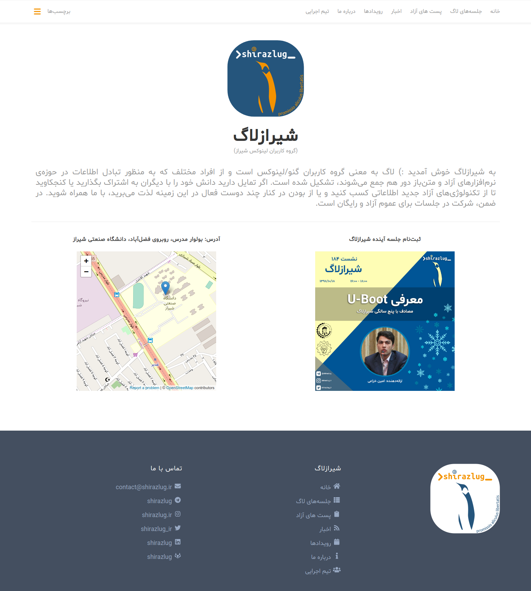

# قالب راست‌چین شده ReFresh-rtl برای Hugo

[ReFresh](https://github.com/PippoRJ/hugo-refresh) قالبی است برای [هیوگو](https://gohugo.io) که برای استفاده در سایت [شیرازلاگ](https://shirazlug.ir/) توسط اعضای این گروه، ساختار راست‌به‌چپ گرفته است.

در زیر نمایی کلی از سایت [شیرازلاگ (گروه کاربران لینوکس شیراز) ](https://shirazlug.ir/) را مشاهده می‌کنید. 

> این قالب برای وب‌سایت و وب‌لاگ‌های شخصی توسعه داده شده است. اگر تمایل به بهبود عملکرد و ویژگی‌های قالب دارید، merge request ارسال کنید.
